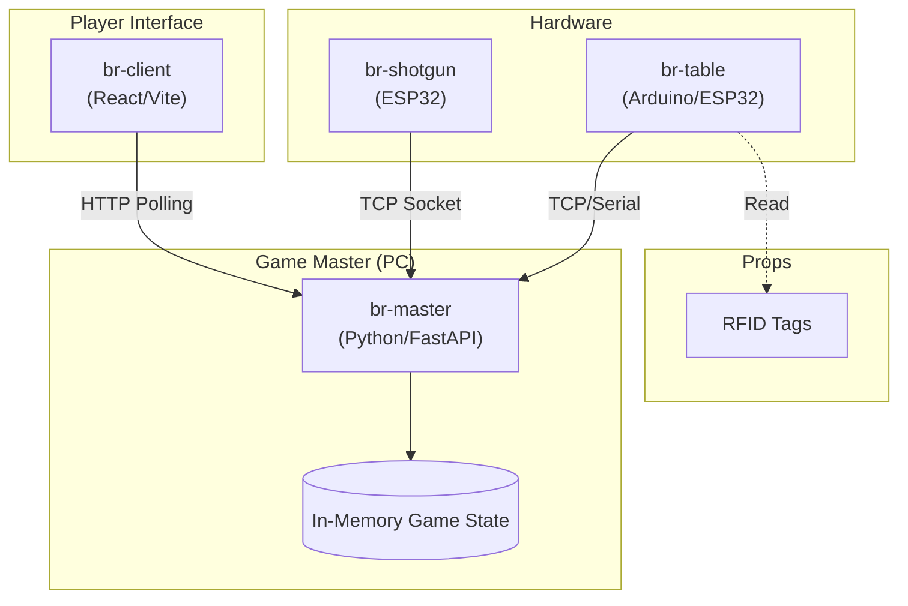

# Buckshot Roulette System Documentation

企画についてはこちらをご覧ください。

https://docs.google.com/document/d/10nxpSHk5lyHqWwNuDh7gPnl_4ZbK7xqgBRiF-XYg-T8/edit

このディレクトリには、リアル「Buckshot Roulette」プロジェクトのシステム詳細ドキュメントが含まれています。

## システム概要

本プロジェクトは、PCゲーム「Buckshot Roulette」を物理的なデバイスと連携させて再現するシステムです。
中央の管理サーバー（Master）、プレイヤー用端末（Client）、および物理的なショットガンデバイス（Shotgun）が連携して動作します。

### アーキテクチャ

## コンポーネント

プロジェクトは以下の3つの主要コンポーネントで構成されています。

### 1. [Master (バックエンド)](./master.md)
- **ディレクトリ**: `br-master/`
- **役割**: ゲームの進行管理、状態保持、APIサーバー。
- **技術**: Python, FastAPI

### 2. [Client (フロントエンド)](./client.md)
- **ディレクトリ**: `br-client/`
- **役割**: プレイヤーへの情報表示（ライフ、アイテム、ターン通知）。
- **技術**: TypeScript, React, Vite

### 3. [Shotgun (ハードウェア)](./shotgun.md)
- **ディレクトリ**: `br-shotgun/`
- **役割**: 物理的なショットガンの制御、トリガー検知、銃口向き検知。
- **技術**: C++, PlatformIO, ESP32

### 4. [Table (アイテム検知)](./table.md)
- **ディレクトリ**: `br-table/` (予定)
- **役割**: RFIDによるアイテム使用検知。
- **技術**: Arduino / ESP32

## API リファレンス

各コンポーネント間の通信仕様については、以下を参照してください。

- [API ドキュメント](./api.md): Master-Client 間の HTTP API および Master-Shotgun 間の通信プロトコル。

## 開発資料

- [企画書](https://docs.google.com/document/d/10nxpSHk5lyHqWwNuDh7gPnl_4ZbK7xqgBRiF-XYg-T8/edit): プロジェクトの全体計画と要件。Googleアカウントが必要です。
- [技術メモ](./tech.md): 初期の技術選定メモ。
