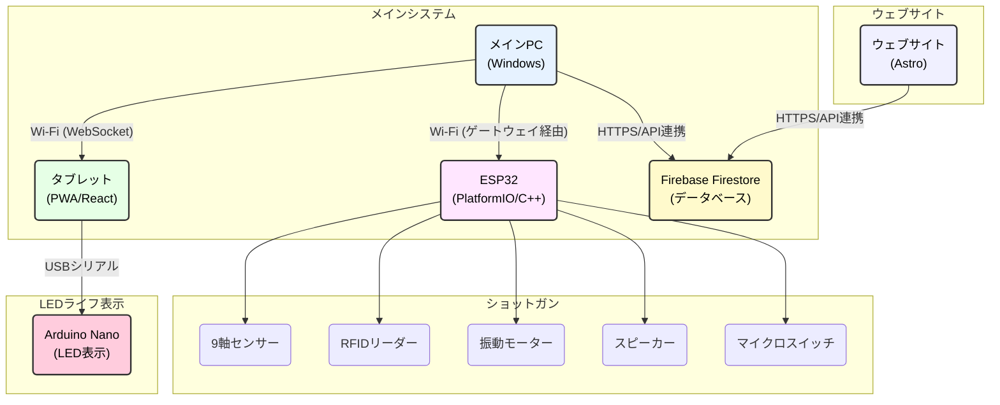

# ショットガンシステムの技術スタック

```mermaid
graph TB
    subgraph "メインシステム"
        MainPC("メインPC<br>(Windows)")
        MainPC -- Wi-Fi (ゲートウェイ経由) --> ESP32("ESP32<br>(PlatformIO/C++)")
        MainPC -- Wi-Fi (WebSocket) --> TabletPWA("タブレット<br>(PWA/React)")
        MainPC -- HTTPS/API連携 --> FirebaseDB("Firebase Firestore<br>(データベース)")
    end

    subgraph "ショットガン"
        ESP32 --> MPU9250("9軸センサー")
        ESP32 --> MFRC522("RFIDリーダー")
        ESP32 --> Motor("振動モーター")
        ESP32 --> Speaker("スピーカー")
        ESP32 --> Switch("マイクロスイッチ")
    end

    subgraph "ウェブサイト"
        Website("ウェブサイト<br>(Astro)")
        Website -->|HTTPS/API連携| FirebaseDB
    end

    subgraph "LEDライフ表示"
        TabletPWA -- USBシリアル --> ArduinoNano("Arduino Nano<br>(LED表示)")
    end

    style MainPC fill:#e6f2ff,stroke:#333,stroke-width:2px,color:#000
    style ESP32 fill:#ffe6ff,stroke:#333,stroke-width:2px,color:#000
    style TabletPWA fill:#e6ffe6,stroke:#333,stroke-width:2px,color:#000
    style Website fill:#f0f0ff,stroke:#333,stroke-width:2px,color:#000
    style FirebaseDB fill:#fffacc,stroke:#333,stroke-width:2px,color:#000
    style ArduinoNano fill:#ffccdd,stroke:#333,stroke-width:2px,color:#000
```
