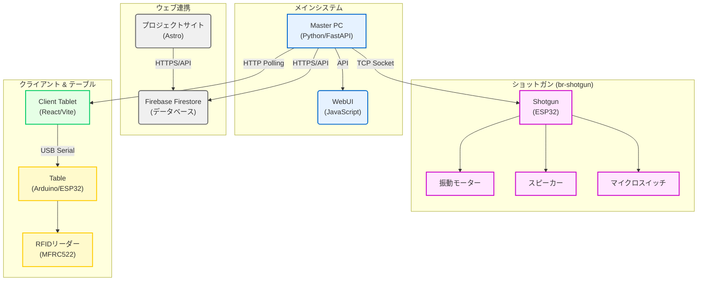

# ショットガンシステムの技術スタック

```mermaid
flowchart TB
    %% スタイル定義
    classDef default fill:#f9f9f9,stroke:#333,stroke-width:1px;
    classDef master fill:#e6f2ff,stroke:#0066cc,stroke-width:2px;
    classDef client fill:#e6ffe6,stroke:#00cc66,stroke-width:2px;
    classDef shotgun fill:#ffe6ff,stroke:#cc00cc,stroke-width:2px;
    classDef table fill:#fffacc,stroke:#ffcc00,stroke-width:2px;
    classDef web fill:#f0f0f0,stroke:#666,stroke-width:2px;

    subgraph MainSystem ["メインシステム"]
        direction TB
        Master["Master PC<br>(Python/FastAPI)"]:::master
        WebUI("WebUI<br>(JavaScript)"):::master
        Master -- API --> WebUI
    end

    subgraph Web ["ウェブ連携"]
        direction TB
        FirebaseDB("Firebase Firestore<br>(データベース)"):::web
        Website("プロジェクトサイト<br>(Astro)"):::web
        Master -- HTTPS/API --> FirebaseDB
        Website -->|HTTPS/API| FirebaseDB
    end

    subgraph ShotgunSystem ["ショットガン (br-shotgun)"]
        direction TB
        Shotgun["Shotgun<br>(ESP32)"]:::shotgun
        Motor["振動モーター"]:::shotgun
        Speaker["スピーカー"]:::shotgun
        Switch["マイクロスイッチ"]:::shotgun
        
        Shotgun --> Motor
        Shotgun --> Speaker
        Shotgun --> Switch
    end

    subgraph ClientSystem ["クライアント & テーブル"]
        direction TB
        Client["Client Tablet<br>(React/Vite)"]:::client
        Table["Table<br>(Arduino/ESP32)"]:::table
        RFID["RFIDリーダー<br>(MFRC522)"]:::table
        
        Client -- "USB Serial" --> Table
        Table --> RFID
    end

    %% システム間通信
    Master -- "TCP Socket" --> Shotgun
    Master -- "HTTP Polling" --> Client
```
